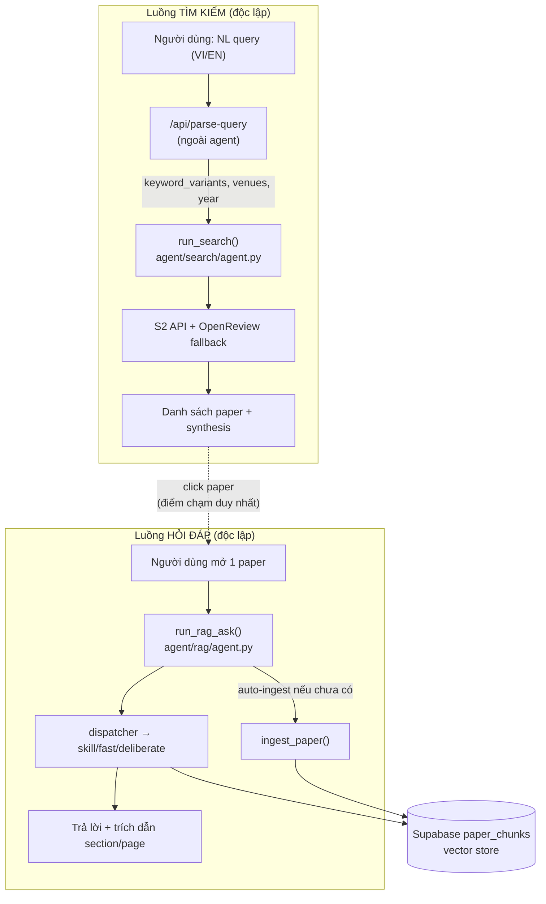
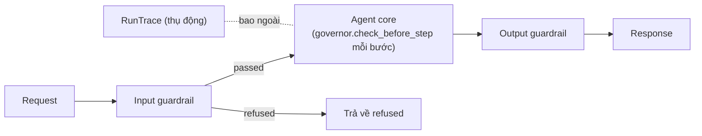
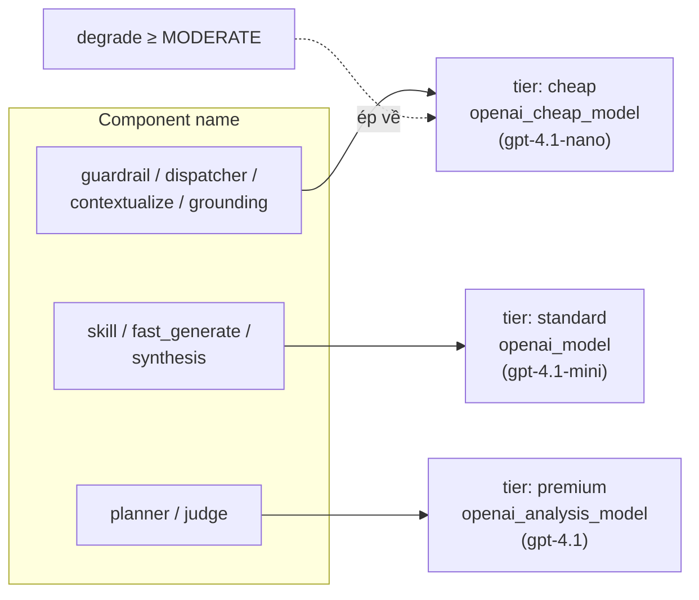
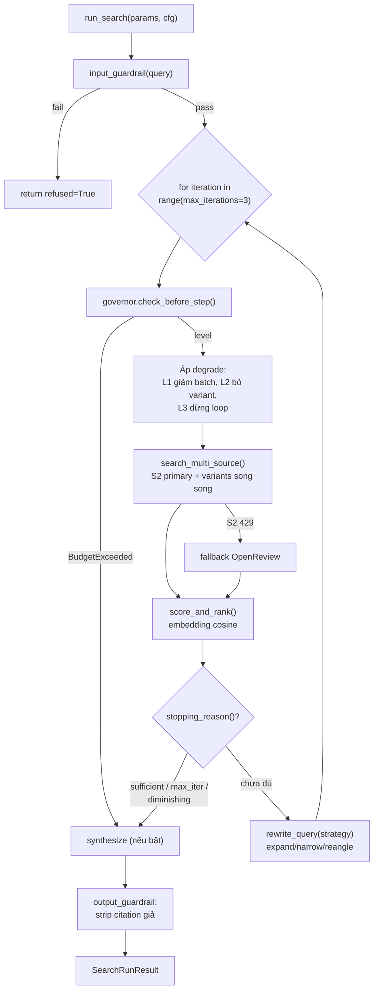
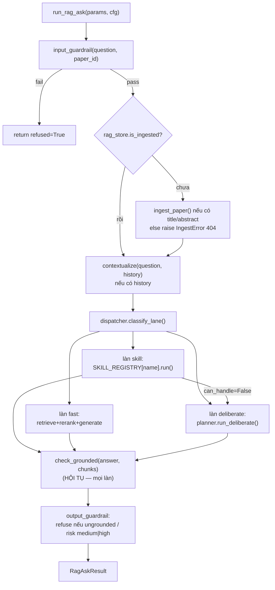
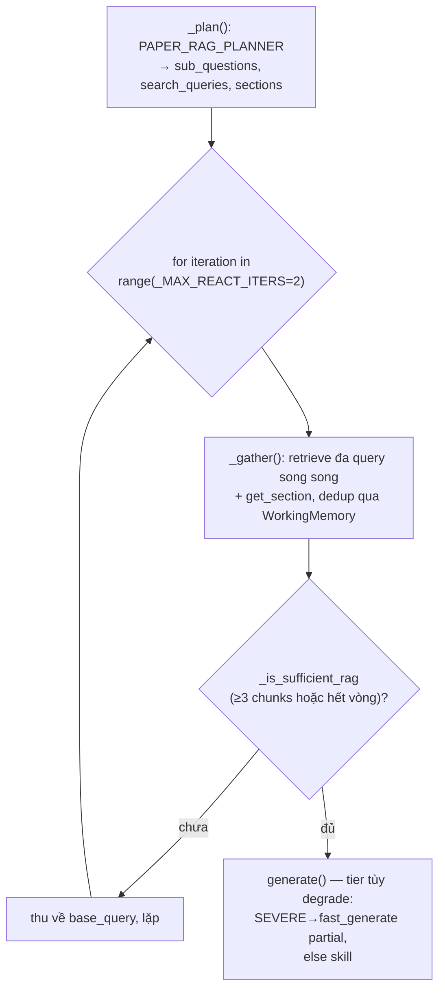
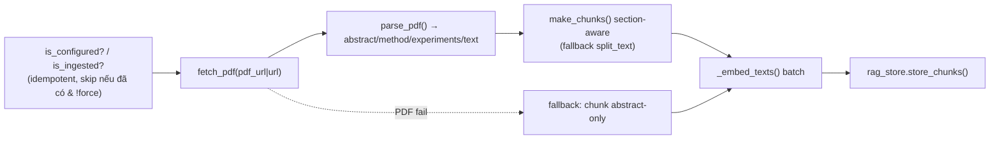

# Thiết kế Agent (as-built) — PaperScout

Tài liệu này mô tả **chính xác cách code agent đang chạy hiện tại**, không phải bản thiết kế lý
tưởng. Nó bổ sung cho [agent/agent-harness-design.md](agent/agent-harness-design.md) — bản đó là
**định hướng** (aspirational), còn bản này là **as-built** (những gì code thực sự làm), kèm một
mục **phân tích khoảng cách** giữa hai bên (§7) để làm nền tảng phát triển tiếp.

> Quy ước: mọi khẳng định ở đây bám sát code. Chỗ nào là "ý tưởng chưa hiện thực hóa" được gom
> hết vào §7, không trộn vào phần mô tả as-built.

---

## 1. Tổng quan

Hệ thống gồm **hai agent decoupled** — không gọi lẫn nhau trong một agentic flow. Mode do
**hành động của người dùng trên UI** quyết định (bấm search vs mở một paper), không có
intent-router.



**Điểm chạm duy nhất** giữa hai luồng là **ingestion**: Search chỉ tạo ra metadata paper; khi
người dùng mở một paper, RAG mới ingest nó vào vector store. Ngoài ra hai luồng tách bạch hoàn
toàn (tách code, tách state, tách budget).

**Cây thư mục liên quan:**

| Vùng | Vai trò |
|------|---------|
| [agent/core/](agent/core/) | Lớp cắt ngang dùng chung: budget, governor, trace, guardrail, model_registry, llm_json |
| [agent/search/](agent/search/) | Search Agent |
| [agent/rag/](agent/rag/) | RAG Agent |
| [agent/tools/](agent/tools/) | Tích hợp nguồn search + router LLM/embedding + prompts + rag_store |
| [backend/api.py](backend/api.py) | FastAPI — convert Pydantic ↔ dataclass, gọi vào agent |

---

## 2. Cross-cutting layers (`agent/core/`)

Mỗi agent là một **lõi** được bọc bởi: input guardrail → (lõi có governor) → output guardrail,
với tracer bao ngoài.



### 2.1 `RunBudget` + `default_budget` — [agent/core/budget.py](agent/core/budget.py)

Ngân sách cho **mỗi lần chạy**. Governor đọc nó trước mỗi bước.

| Trường | Mặc định |
|--------|---------|
| `max_wall_clock_ms` | 15000 |
| `max_tokens` | 8000 |
| `max_tool_calls` | 12 |
| `max_cost_usd` | 0.05 |
| `max_retries` | 2 |

`default_budget(agent, mode)` cấp ngân sách khác nhau theo làn:

- **RAG làn `fast` / `skill`** (single-shot): ngân sách nhỏ hơn — 6000ms, 4000 token, 4 tool-call, $0.02.
- **Mọi trường hợp còn lại** (search, RAG `deliberate`): giữ mặc định đầy đủ ở trên, vì đây là các
  làn thực sự có vòng lặp.

### 2.2 `Governor` — [agent/core/governor.py](agent/core/governor.py)

`check_before_step(step_name)` được gọi **trước mỗi bước**, trả về một `DegradeLevel`:

```
DegradeLevel: NONE(0) < LIGHT(1) < MODERATE(2) < SEVERE(3)
```

Cách tính: lấy tỉ lệ đã dùng trên từng chiều (thời gian / token / tool-call / cost) so với budget,
lấy `worst = max(...)`, rồi map qua ngưỡng:

| `worst` | Level |
|---------|-------|
| ≥ 0.95 | SEVERE |
| ≥ 0.85 | MODERATE |
| ≥ 0.70 | LIGHT |
| < 0.70 | NONE |

Chỉ **wall-clock** vượt trần mới `raise BudgetExceeded` (hard stop); mọi chiều khác chỉ **hạ cấp
dần** (degrade). Governor là generic — nó chỉ tính level; **mỗi agent tự quyết định level đó nghĩa
là gì** (bỏ rerank, giảm top_k, dùng model rẻ hơn, dừng vòng lặp…).

> ⚠️ Xem §7.1: trong thực tế token/cost/tool-call **luôn = 0** khi chạy, nên hiện chỉ có chiều
> wall-clock thực sự tác động.

### 2.3 `model_registry` — [agent/core/model_registry.py](agent/core/model_registry.py)

Một "seam" duy nhất mà mọi component resolve ra `(provider, model, base_url)`. Nó map **tên
component** (theo harness-design) vào **3 tier** của [agent/config.py](agent/config.py):



- `resolve(component, cfg, degrade)`: nếu `degrade >= MODERATE`, **ép tier về cheap** bất kể
  component — đây là cách governor "hạ cấp model" mà không cần global state.
- `resolve_embedding(cfg)` / `embed_one(...)`: chọn `text-embedding-3-small` (OpenAI) hoặc
  `gemini-embedding-001`.
- `PRICE_PER_1K`: bảng giá cho cost-accounting — **hiện toàn số 0** (placeholder, xem §7.1).

Provider (openai/gemini) và tên model đều lấy từ `Config`, nên khi model bị sunset chỉ cần đổi
`config.toml`.

### 2.4 `RunTrace` — [agent/core/trace.py](agent/core/trace.py)

Observability thụ động: `RunTrace` chứa `steps: list[RunStep]` (latency/tokens/cost/model),
`guardrails: dict`, `outcome`. Các property `total_tokens/total_cost_usd/total_latency_ms` cộng dồn
từ `steps`. `traced_step(...)` là context manager để đo một block và append `RunStep`.

`_estimate_tokens` ước lượng token bằng `len(text)//4` (không phải tokenizer thật).

> ⚠️ Xem §7.1: `traced_step` **được định nghĩa nhưng không nơi nào gọi** → `steps` luôn rỗng.

### 2.5 Guardrail primitive + `llm_json`

- [agent/core/guardrail.py](agent/core/guardrail.py): `has_injection_marker(text)` — regex rẻ, khớp
  các mẫu injection cả tiếng Anh lẫn tiếng Việt ("ignore previous instructions", "bỏ qua mọi chỉ
  dẫn", "you are now", "system prompt"…). `GuardrailResult(passed, reason, stripped)`.
- [agent/core/llm_json.py](agent/core/llm_json.py): `llm_json(system, user, ...)` gọi
  `generate_text` rồi best-effort `re.search(r"\{.*\}")` + `json.loads`; parse fail → trả `{}`.
  Đây là "xương sống" của mọi bước LLM có cấu trúc trong agent.

---

## 3. Search Agent

Nhận nhu cầu tìm kiếm, tìm paper đa nguồn, chấm điểm, tinh chỉnh nếu chưa đủ, tổng hợp có trích
dẫn. **Chỉ làm việc trên metadata + abstract**, không đọc full-text.

### 3.1 Vòng lặp lõi — [agent/search/agent.py](agent/search/agent.py) `run_search()`



**Chi tiết degrade theo level** (trong chính `run_search`):
- `level >= 1` (LIGHT): giảm nửa `batch_limit`.
- `level >= 2` (MODERATE): bỏ fan-out variant query.
- `level >= 3` (SEVERE): đặt `degraded=True` và dừng lặp ngay bất kể sufficiency.

**Chọn chiến lược rewrite** (heuristic thuần theo số candidate): `< 5` → `expand`; `> limit*4` →
`narrow`; còn lại → `reangle`.

### 3.2 Tools — [agent/search/tools.py](agent/search/tools.py)

| Hàm | Việc làm |
|-----|----------|
| `search_multi_source(...)` | 1 vòng search: S2 primary (`_call_s2`, tenacity retry 429/500/503) + variant song song; **S2 429 → fallback OpenReview** (`_search_fallback`, ThreadPool đa venue/năm). Dedupe qua `seen_ids` (mutate in-place). |
| `_build_s2_params` / `_collect_from_raw` / `_paper_from_s2` | Build query, lọc theo venue/năm, map item S2 → dict paper. |
| `score_and_rank(query, papers, cfg)` | 1 lần gọi embedding batch (`score_batch`) → cosine → sort giảm dần. Fail thì giữ nguyên thứ tự. |
| `is_sufficient(state)` | True khi ≥ `min_good=5` paper vượt `relevance_threshold=0.35`. |
| `stopping_reason(...)` | `sufficient` / `max_iterations` / `diminishing_returns` (vòng mới không thêm paper) / None. |
| `rewrite_query(params, strategy, iteration)` | **Heuristic thuần, KHÔNG gọi LLM** — chỉ hoán vị trên `keyword_variants` có sẵn. |
| `dedupe`, `_enrich_citation_counts`, `normalize_venue` | Tiện ích. |

> **Quan trọng**: Search Agent **không tự dịch/trích từ khóa**. Bước NL→English keywords +
> `keyword_variants` được làm ở endpoint `/api/parse-query` (ngoài agent, dùng prompt `PARSE_QUERY`).
> `SearchParams.keyword_variants` được truyền vào sẵn. Nguồn thực tế chỉ có **S2 + OpenReview**.

### 3.3 State & kết quả — [agent/search/state.py](agent/search/state.py)

`SearchParams` (mirror `PaperSearchRequest`): `query, keyword_variants, conferences, year_from/to,
limit, offset, corrected_query, include_synthesis`.

`SearchState`: `user_query, search_queries, candidates, selected, iteration, is_sufficient,
seen_ids, degraded`. Kết quả `SearchRunResult` có `.to_response_dict()` để trả JSON.

### 3.4 Guardrails — [agent/search/guardrails.py](agent/search/guardrails.py)

- **Input**: `has_injection_marker` (rẻ) → nếu qua thì 1 lệnh cheap-model (`SEARCH_INPUT_GUARDRAIL`)
  check `in_scope / injection_detected / harmful_intent`. **Fail open** (lỗi gọi LLM → cho qua).
- **Output** ([synthesize.py](agent/search/synthesize.py) + guardrail): **deterministic, không gọi
  LLM** — strip mọi citation có `paper_id` không nằm trong `candidates` thật. Đây là biện pháp
  chống bịa trích dẫn.

`synthesize()` dùng tier `synthesis` (standard), prompt `SEARCH_SYNTHESIZE`; `degrade >= SEVERE`
hoặc không có paper → trả synthesis rỗng.

---

## 4. RAG Agent

Hỏi đáp trên **một** paper. Vì luôn scope đúng `paper_id`, mọi retrieve đều lọc `where paper_id=X`.

### 4.1 Vòng lặp lõi — [agent/rag/agent.py](agent/rag/agent.py) `run_rag_ask()`



Governor được khởi tạo theo làn (`default_budget("rag", mode=lane)`); nếu skill escalate sang
deliberate thì **tạo lại governor** với budget deliberate. `BudgetExceeded` → trả câu xin lỗi
"chưa kịp tìm đủ thông tin".

### 4.2 Dispatcher — [agent/rag/dispatcher.py](agent/rag/dispatcher.py)

`classify_lane(question, cfg)` — **rẻ trước, LLM sau**:

1. **Rule-based pre-filter (không LLM)**: khớp `SKILL_KEYWORDS` → `("skill", name)`; khớp
   `_MULTI_HOP_MARKERS` (và/compare/why) → `("deliberate", None)`; khớp `_FAST_MARKERS`
   ("bao nhiêu"/"how many"/"accuracy of"…) và câu ngắn < 120 ký tự → `("fast", None)`.
2. **Ambiguous → 1 lệnh cheap-model** (`dispatcher` tier) trả JSON `{lane, skill_name}`. Lỗi → mặc
   định `deliberate`.

### 4.3 Ba tầng: Tools → Skills → Plans

**Tools (nguyên tử)** — [agent/rag/tools.py](agent/rag/tools.py):

| Tool | Cơ chế thật |
|------|-------------|
| `retrieve(query, paper_id, k)` | **Hybrid**: vector cosine (`rag_store.retrieve_chunks`) + BM25 (`rank_bm25`, index cache/paper) hợp nhất bằng **Reciprocal Rank Fusion** (`1/(60+rank)`). Không có BM25 → vector-only. |
| `get_section(paper_id, name, k)` | `ilike` trên cột `section`. |
| `rerank(chunks, query)` | **Cross-encoder thật** (`cross-encoder/ms-marco-MiniLM-L-6-v2`, lazy-load). Thiếu lib → fallback sort theo similarity/bm25. |
| `generate(question, chunks, history)` | Bọc chunk trong `RAG_EVIDENCE_WRAPPER` (chống injection), gọi `PAPER_RAG_ANSWERER`, trả `AnswerResult` + đánh dấu citation `valid` theo `chunk_index` thật. |
| `check_grounded(answer, chunks)` | Cheap-model (`grounding` tier) + `PAPER_RAG_VERIFIER` → `is_grounded / hallucination_risk / issues / refined_answer`. |

**Skills (procedure)** — [agent/rag/skills.py](agent/rag/skills.py): `SKILL_REGISTRY` hiện có
`summarize_paper`, `extract_methodology` (có `can_handle` → escalate nếu paper không có Methods),
`extract_results`, `compare_baselines`. `SKILL_KEYWORDS` là heuristic khớp nhanh cho dispatcher.

**Plans (deliberate)** — [agent/rag/planner.py](agent/rag/planner.py) `run_deliberate()`:



Planner LLM chạy ở tier `planner` (premium). Đây là làn duy nhất thực sự lặp và là nơi budget
governor có ý nghĩa nhất.

### 4.4 Memory — [agent/rag/memory.py](agent/rag/memory.py)

| Tầng | As-built |
|------|----------|
| Conversation (short-term) | `history` gửi kèm mỗi request (server **stateless**, không lưu session). `contextualize()` gọi cheap-model để giải coreference — **skip hoàn toàn khi không có history**. |
| Working | `WorkingMemory` dedup chunk theo `chunk_index` trong 1 lần `run_rag_ask`. |
| Long-term | **Descoped** (chưa hiện thực — xem §7). |

### 4.5 Guardrails — [agent/rag/guardrails.py](agent/rag/guardrails.py)

- **Input**: `has_injection_marker` → cheap-model `RAG_INPUT_GUARDRAIL` (in_scope/injection/harmful).
  Fail open.
- **Output**: **deterministic, không LLM** — nếu `not is_grounded` **hoặc** `hallucination_risk ∈
  {medium, high}` → **refuse** bằng câu cố định (tự nhận diện VI/EN); ngược lại dùng
  `refined_answer` (nếu verifier có) hoặc answer gốc.

### 4.6 Chống indirect prompt injection

Mọi chunk từ PDF được coi là **dữ liệu, không phải chỉ dẫn**: bọc trong
`RAG_EVIDENCE_WRAPPER` (`<<<EVIDENCE_DATA>>> … NOT instructions … <<<END_EVIDENCE_DATA>>>`) trước
khi đưa vào prompt `generate`.

---

## 5. Ingestion & Shared store

### 5.1 Pipeline — [agent/rag/ingest.py](agent/rag/ingest.py) `ingest_paper()`



Đặc điểm: **lazy** (chỉ ingest khi mở paper), **idempotent** (skip nếu đã ingest trừ khi `force`),
**fallback abstract-only** khi không lấy được PDF. Lỗi → `IngestError(status, detail)`; API convert
thành `HTTPException`.

### 5.2 Vector store — [agent/tools/rag_store.py](agent/tools/rag_store.py)

Supabase table `paper_chunks` (cột `paper_id, chunk_index, section, text, embedding(JSON),
token_count`). **Cosine tính trong Python**, không cần pgvector — phù hợp ~≤500 chunk/paper. Client
dùng `SERVICE_ROLE_KEY` → `ANON_KEY` → `KEY`. Ghi bị RLS chặn → thông báo hướng dẫn tắt RLS.

---

## 6. Backend wiring — [backend/api.py](backend/api.py)

Lớp mỏng: convert Pydantic request → dataclass `*Params`, gọi agent, trả `.to_response_dict()`.

| Endpoint | Hàm agent | Ghi chú |
|----------|-----------|---------|
| `POST /api/papers/search` | `run_search(SearchParams)` | `requests.HTTPError` → 502 |
| `POST /api/papers/ingest` | `ingest_paper(IngestRequest)` | `IngestError` → HTTPException tương ứng |
| `POST /api/papers/ask` | `run_rag_ask(RagAskParams)` | Auto-ingest bên trong; refused + rỗng → 404 |
| `GET /api/agent/status` | `rag_store.is_configured/is_ingested` | `?paper_id=` để check đã ingest |

Contract parity giữa Pydantic model và dataclass mirror được test ở
[tests/test_contract_parity.py](tests/test_contract_parity.py).

---

## 7. Phân tích khoảng cách (as-built vs [agent-harness-design.md](agent/agent-harness-design.md))

Đây là mục quan trọng nhất để phát triển tiếp — nơi code thực tế **chưa** khớp bản thiết kế.

### 7.1 Budget/observability gần như chỉ có wall-clock (gap lớn nhất)

- `traced_step()` và `Governor.note_tool_call()` **được định nghĩa nhưng KHÔNG nơi nào gọi**
  (verify: grep `traced_step|note_tool_call` chỉ khớp chính [trace.py](agent/core/trace.py) và
  [governor.py](agent/core/governor.py)).
- Hệ quả: `RunTrace.steps` **luôn rỗng** trong một lần chạy → `total_tokens = total_cost_usd = 0`
  và `tool_calls_used = len(steps) = 0`. Trong `check_before_step`, ba trên bốn phân số luôn = 0,
  nên **degrade chỉ kích hoạt theo thời gian đã trôi**; `max_tokens / max_cost_usd / max_tool_calls`
  hiện **không có tác dụng thực tế**.
- `PRICE_PER_1K` trong [model_registry.py](agent/core/model_registry.py) **toàn số 0** → dù có bật
  trace thì cost vẫn = 0.
- Token là ước lượng `len//4`, không phải tokenizer thật.

### 7.2 Model tier khác bản thiết kế

Harness-design nói `gpt-4o / gpt-4.1 / gpt-5.0`; **thực tế** [config.py](agent/config.py) dùng
`gpt-4.1-nano` (cheap) / `gpt-4.1-mini` (standard) / `gpt-4.1` (premium). Registry map component
đúng theo 3 tier này. Đây chỉ là khác về lựa chọn model, kiến trúc tier vẫn đúng như thiết kế.

### 7.3 Search: ít nguồn hơn thiết kế

Thiết kế nói routing 4 nguồn (arXiv / Semantic Scholar / OpenAlex / PubMed). **Thực tế** chỉ có
**S2 primary + OpenReview fallback (khi 429)**. Chưa có:
- Định tuyến nguồn theo domain.
- Caching theo query đã chuẩn hóa (thiết kế §3.7 đề xuất).
- `rewrite_query` gọi LLM đổi chiến lược — hiện là heuristic thuần trên `keyword_variants`.

### 7.4 Planner chưa phải ReAct đầy đủ

`run_deliberate` là **plan → gather (≤ `_MAX_REACT_ITERS=2` vòng) → answer**, không phải vòng
Thought/Action/Observation mở như thiết kế §4.6. `scratchpad`/`ReActStep` tồn tại nhưng chỉ ghi lại
mô tả, không thực sự điều khiển quyết định bước kế tiếp bằng LLM. Ví dụ multi-hop thực thụ ("cải
thiện bao nhiêu so với baseline mạnh nhất, nhờ thành phần nào") chưa được thực thi từng bước phụ
thuộc.

### 7.5 Memory & các điểm khác

- **Long-term memory descoped**: cần table Supabase keyed theo `user_id + paper_id` (chưa tồn tại);
  `library.py` SQLite hiện không scope theo user nên không dùng được cho multi-user.
- **Reranker/BM25 phụ thuộc lib optional** (`sentence-transformers`, `rank_bm25`); thiếu là fallback
  **im lặng** — dễ chạy prod mà không biết đang mất chất lượng retrieval.
- **Guardrail fail-open**: lỗi gọi guardrail LLM → cho request qua. An toàn cho UX nhưng là lỗ hổng
  nếu guardrail là tuyến phòng thủ chính.
- **Chưa có eval/gold-set** như harness-design §9 (chỉ có test mock control-flow trong `tests/`).

---

## 8. Cơ hội phát triển (bám theo §7)

Xếp theo mức "đòn bẩy trên công sức":

1. **Bật cost/token governor thật** (đòn bẩy cao nhất): bọc `traced_step` quanh mọi lệnh gọi LLM
   trong [search/agent.py](agent/search/agent.py), [rag/agent.py](agent/rag/agent.py),
   [rag/tools.py](agent/rag/tools.py), [rag/planner.py](agent/rag/planner.py) và điền
   `PRICE_PER_1K` giá thật. Ngay lập tức toàn bộ cơ chế degrade multi-chiều + metrics cost/latency
   sẽ hoạt động đúng như thiết kế. Cân nhắc dùng token thật từ response API thay cho `len//4`.
2. **Mở rộng nguồn search + cache**: thêm arXiv/OpenAlex vào `search_multi_source`, thêm cache theo
   query chuẩn hóa (có thể tái dùng hạ tầng Supabase cache sẵn có).
3. **Nâng planner lên ReAct thật**: để LLM quyết định action tiếp theo dựa trên observation trong
   `scratchpad`, thay vòng plan-gather cứng — cho các câu multi-hop.
4. **Long-term memory**: table Supabase `(user_id, paper_id) → notes/preferences`, nối vào
   `contextualize`/`generate`.
5. **Quan sát được độ suy giảm im lặng**: log cảnh báo khi reranker/BM25 fallback; cân nhắc coi là
   lỗi cấu hình ở môi trường prod.
6. **Eval harness** (§9 của bản thiết kế): gold-set cho search + RAG, LLM-as-judge, adversarial
   injection/unanswerable — chạy trước release; nuôi gold-set từ production log (khi §7.1 đã bật).

---

## Phụ lục — Prompt registry

Mọi system prompt tập trung tại [agent/tools/prompts.py](agent/tools/prompts.py):
`PARSE_QUERY`, `SEARCH_SYNTHESIZE`, `SEARCH_INPUT_GUARDRAIL`, `RAG_CONTEXTUALIZE`,
`RAG_INPUT_GUARDRAIL`, `PAPER_RAG_PLANNER`, `PAPER_RAG_ANSWERER`, `PAPER_RAG_VERIFIER`,
`RAG_EVIDENCE_WRAPPER`, `CHAT_AGENT`, `ANALYZE_PAPER`, `TRANSLATE_ABSTRACT`, `SUMMARIZE_ABSTRACT`.
