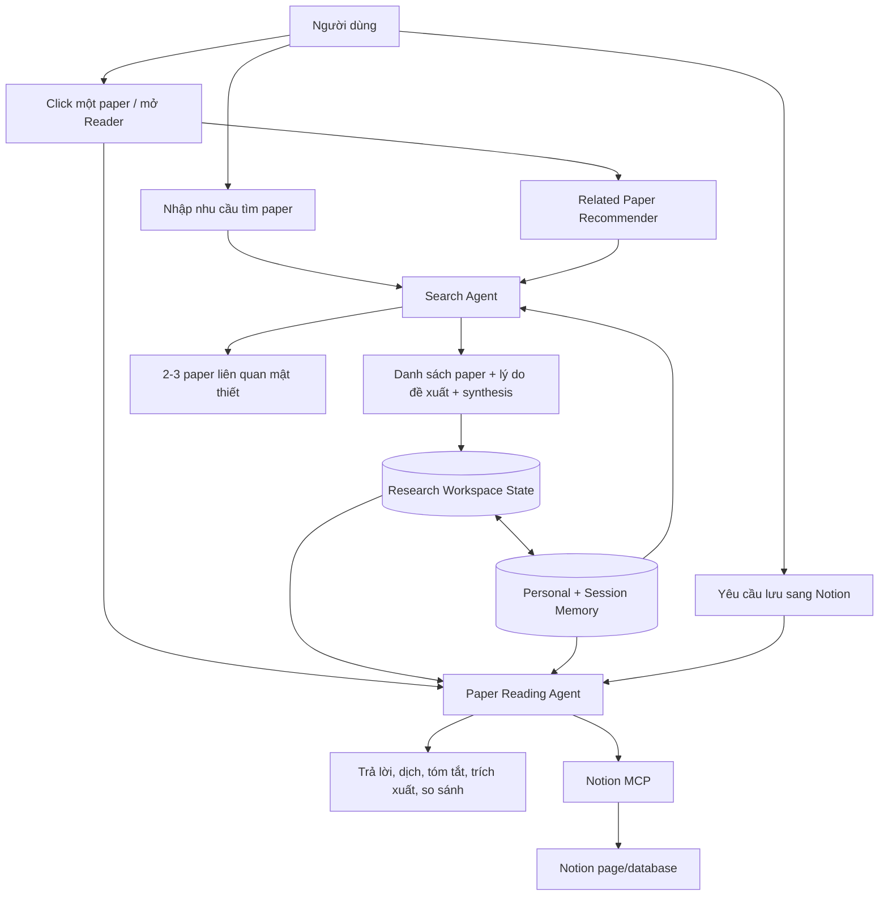
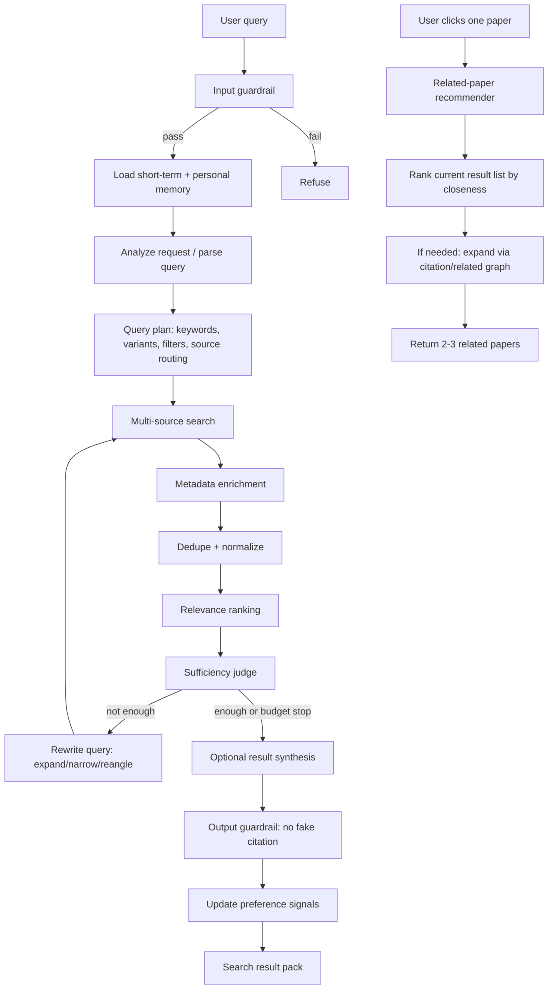
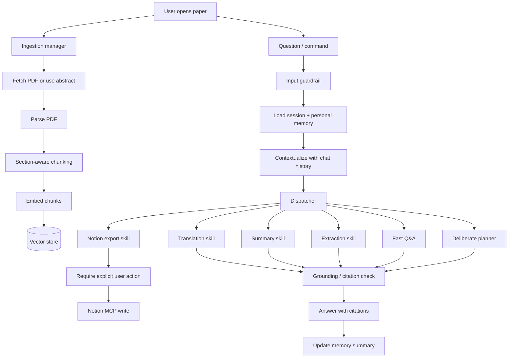

# Ý tưởng thiết kế lại Agent Flow cho PaperScout

Tài liệu này tổng hợp lại ý tưởng 2 agent cho PaperScout sau khi đối chiếu với `agent_design.md` và `agent/agent-harness-design.md`.

Mục tiêu không phải là tạo thêm nhiều agent phức tạp, mà là làm rõ ranh giới trách nhiệm:

- **Search Agent**: hiểu nhu cầu nghiên cứu của người dùng, tìm paper phù hợp, xếp hạng, trả về danh sách paper có nguồn gốc rõ ràng, và gợi ý paper liên quan khi người dùng chọn một bài.
- **Paper Reading Agent**: đọc một paper cụ thể, hỏi đáp/tóm tắt/dịch/trích xuất thông tin từ paper đó, và chỉ ghi ra Notion khi người dùng yêu cầu.

Hai agent nên độc lập. Điểm nối duy nhất là **Research Workspace State + Memory Layer**: kết quả search tạo metadata paper; khi người dùng mở một paper, Paper Reading Agent ingest PDF/abstract của paper đó để đọc; memory giúp cả hai agent hiểu lịch sử hội thoại, chủ đề người dùng hay tìm, phong cách trả lời ưa thích và các paper đã đọc/lưu.

---

## 0. Quyết định nền tảng đã chốt

Các quyết định này định hình toàn bộ thiết kế phía dưới. Mọi phần mô tả `user_id`, Supabase-backed memory, hay "Notion MCP" trong các mục cũ được **override** bởi bảng này.

| Quyết định | Chốt | Hệ quả thiết kế |
|---|---|---|
| **Mô hình người dùng** | **Single-user, no-auth** (giữ đúng commit `convert to single-user local research assistant`). | `user_id` cố định `"local"` (hoặc bỏ khỏi API). Không `/auth/*`, không JWT, không privacy multi-user. Memory khóa theo `paper_id` / `session_id`. |
| **Nơi lưu long-term memory** | **Local `library.sqlite3`** (tận dụng bảng `profile` sẵn có; thêm `memory_events` + `preferences`). | KHÔNG đẩy memory cá nhân lên Supabase chung — đó là DB dùng chung mọi người clone repo, RLS đang tắt → sẽ rò rỉ chéo. Supabase chỉ giữ thứ không cá nhân: `paper_cache`, `paper_chunks`. |
| **Tích hợp Notion** | **Backend-driven + Notion SDK token** (`notion-client` + integration token trong `backend/.env`). | `agent/tools/notion_client.py` deterministic, idempotent, chạy độc lập không cần Claude/MCP. Nút UI "Save to Notion" → `POST /api/papers/export/notion`. Các chỗ gọi "Notion MCP" phía dưới đọc là "Notion client wrapper". |

**Nguyên tắc write-path memory** (bổ sung): tách "ghi event" (append rẻ, đồng bộ) khỏi "suy ra preference" (gọi LLM, chạy lazy/batch — chỉ khi query mơ hồ hoặc định kỳ). Không gọi LLM cập nhật memory sau mỗi message.

**`related` vs `recommend`** (bổ sung): `/api/papers/related` (mới) = tier-1 rank-in-session; tier-2 fallback **bọc lại** `recommend_from_openalex` đã có trong `agent/tools/recommend.py`, không viết lại citation-graph.

**Handoff giữa 2 agent**: bằng tín hiệu, không import chéo. Reading Agent trả `action: "suggest_search"` + query gợi ý để frontend chuyển màn, không tự gọi Search Agent.

---

## 1. Định hướng tổng thể

### 1.1 Luồng sản phẩm đề xuất



### 1.2 Nguyên tắc thiết kế

| Nguyên tắc | Quyết định thiết kế |
|---|---|
| Tách vai trò | Search Agent không đọc full paper; Paper Reading Agent không tự ý search paper mới. |
| Có provenance | Search citation trỏ về `paper_id`/DOI/source; RAG citation trỏ về `section/page/chunk`. |
| Không ghi ngoài khi chưa được yêu cầu | Notion MCP chỉ được gọi sau hành động rõ ràng như "lưu vào Notion", "tạo note", "export". |
| Tối ưu chi phí | Việc nhẹ dùng rule/model nhỏ; planner và synthesis phức tạp mới dùng model mạnh. |
| Có điểm dừng | Cả search loop và reading planner đều có budget, max iteration, fallback. |
| Dữ liệu ngoài là không tin cậy | Nội dung web/PDF/chunk chỉ là evidence, không bao giờ là instruction. |
| Memory có kiểm soát | Short-term memory giữ đoạn chat hiện tại; long-term memory chỉ lưu sở thích/chủ đề/phong cách đã được suy ra hoặc người dùng xác nhận. |

---

## 2. Agent 1 - Search Agent

### 2.1 Nhiệm vụ

Search Agent nhận yêu cầu tự nhiên của người dùng, thường bằng tiếng Việt hoặc tiếng Anh, và trả về danh sách paper phù hợp.

Ví dụ yêu cầu:

- "Tìm paper về diffusion model cho medical image segmentation từ 2022."
- "Có paper nào ở ICML/ICLR về reinforcement learning cho robotics không?"
- "Tìm giúp tôi survey mới nhất về retrieval augmented generation."

Search Agent chỉ làm việc với:

- metadata,
- abstract,
- citation count,
- venue/year,
- DOI/arXiv/Semantic Scholar/OpenAlex/OpenReview identifiers,
- open access PDF URL nếu có.

Search Agent **không** phân tích full-text. Khi cần đọc sâu, người dùng mở paper và chuyển sang Paper Reading Agent.

Ngoài tìm kiếm theo query, Search Agent còn có một nhiệm vụ phụ quan trọng: **gợi ý paper liên quan mật thiết** khi người dùng click/mở một paper. Gợi ý này nên trả 2-3 paper gần nhất với bài đang đọc, ưu tiên paper trong danh sách kết quả hiện tại trước, rồi mới mở rộng ra citation graph hoặc nguồn ngoài.

### 2.2 Flow chi tiết



### 2.3 Tool cần có cho Search Agent

| Tool | Mục đích | Gợi ý triển khai |
|---|---|---|
| `analyze_user_request` | Hiểu intent, domain, keyword, venue, year, language, constraints | Hiện tương ứng với `/api/parse-query`; nên đưa logic này vào `agent/search/` để Search Agent tự chủ hơn. |
| `translate_academic_query` | Dịch tiếng Việt sang thuật ngữ học thuật tiếng Anh | Dùng model nhỏ + term map cố định cho các thuật ngữ phổ biến. |
| `load_personal_memory` | Lấy chủ đề/phong cách/lịch sử tìm kiếm thường gặp của người dùng | Chỉ dùng memory dạng summary, không nhồi toàn bộ lịch sử dài vào prompt. |
| `load_session_memory` | Lấy đoạn chat hiện tại và các filter/paper đang hiển thị | Dùng để hiểu câu như "lọc tiếp", "tìm thêm kiểu này", "bài giống paper thứ 2". |
| `rewrite_query` | Tạo biến thể query để tăng recall | Expand/narrow/reangle; có thể dùng LLM khi heuristic không đủ. |
| `route_sources` | Chọn nguồn phù hợp thay vì gọi tất cả | CS/AI: S2, arXiv, OpenReview, OpenAlex; biomedical: PubMed; general citation: Crossref/OpenAlex. |
| `search_semantic_scholar` | Nguồn metadata/citation rộng | Đã có trong code dưới dạng S2 primary. |
| `search_openreview` | Paper hội nghị ML mới | Đã dùng làm fallback khi S2 rate-limit. |
| `search_openalex` | Metadata, related/citing works, citation graph | Repo đã có tool OpenAlex; nên nối vào Search Agent chính. |
| `search_arxiv` | Preprint, PDF URL tốt | Repo đã có `agent/tools/arxiv.py`; nên nối vào source router. |
| `search_pubmed` | Nếu mở rộng sang y sinh | Chưa cần MVP nếu trọng tâm là CS/AI. |
| `web_search_fallback` | Tìm web khi API chính không đủ | Chỉ dùng fallback có kiểm soát domain, không dùng làm nguồn chính. |
| `fetch_metadata_from_url` | Người dùng paste URL/DOI/arXiv link | Repo đã có `web_fetch.py` và `paper_detail.py`. |
| `dedupe_papers` | Gộp trùng theo DOI, arXiv ID, S2 ID, normalized title | Cần mạnh hơn `paper_id`-only vì multi-source sẽ sinh trùng. |
| `normalize_venue` | Chuẩn hóa NeurIPS/NIPS/ICLR/CVPR... | Đã có một phần trong `agent/search/tools.py`. |
| `score_relevance` | Chấm paper so với query | Đã có embedding cosine; có thể bổ sung LLM judge cho top candidates. |
| `rank_quality` | Ưu tiên paper có venue/citation/year phù hợp | Kết hợp relevance, citation, recency, venue tier, exact filter match. |
| `recommend_related_from_list` | Khi user click một paper, chọn 2-3 bài liên quan trong danh sách đang có | Dùng embedding/title/abstract similarity + shared authors/topic/venue/year. |
| `recommend_related_from_graph` | Nếu danh sách hiện tại không đủ, tìm paper liên quan từ citation graph | Dùng OpenAlex related/citing/cited-by hoặc S2 recommendations. |
| `sufficiency_check` | Quyết định có cần search lại không | Đã có `is_sufficient`; nên nâng bằng tiêu chí coverage/domain. |
| `synthesize_results` | Tóm tắt landscape từ các paper tìm được | Đã có `SEARCH_SYNTHESIZE`, cần giữ citation thật. |
| `cache_search` | Tránh gọi lại cùng query | Cache theo normalized query + filters + source. |
| `explain_ranking` | Nói ngắn vì sao paper được đề xuất | Tăng tin cậy và giúp UI hiển thị tốt hơn. |
| `update_preference_memory` | Cập nhật tín hiệu dài hạn sau search/click/save | Chỉ lưu summary như topic, venues, preferred language, không lưu raw chat vô hạn. |

### 2.4 Search result nên trả về gì

Mỗi paper nên có cấu trúc tối thiểu:

```json
{
  "paper_id": "string",
  "source_ids": {
    "semantic_scholar": "string|null",
    "openalex": "string|null",
    "arxiv": "string|null",
    "doi": "string|null",
    "openreview": "string|null"
  },
  "title": "string",
  "abstract": "string|null",
  "authors": [],
  "year": 2025,
  "venue": "ICLR",
  "url": "string",
  "pdf_url": "string|null",
  "citation_count": 0,
  "relevance_score": 0.82,
  "quality_signals": {
    "matched_filters": ["year", "venue"],
    "source_count": 2,
    "has_pdf": true
  },
  "why_recommended": "1-2 câu giải thích ngắn",
  "related_preview": [
    {
      "paper_id": "string",
      "relation": "same_method|same_task|cites|cited_by|same_authors|semantic_similarity",
      "reason": "vì cùng task medical image segmentation và dùng diffusion backbone"
    }
  ]
}
```

Search response nên gồm:

- `papers`: danh sách paper đã rank,
- `synthesis`: tóm tắt landscape nếu user bật,
- `query_plan`: keywords, variants, filters đã dùng,
- `personalization`: memory nào đã ảnh hưởng đến search, ví dụ language/topic preference ở dạng summary,
- `related_groups`: gợi ý 2-3 paper liên quan cho paper người dùng đang focus nếu có `focus_paper_id`,
- `trace`: số nguồn đã gọi, số vòng rewrite, degrade/budget nếu có,
- `has_more`: còn kết quả để paginate không.

### 2.5 Gợi ý paper liên quan khi người dùng click paper

Khi người dùng bấm vào một paper trong danh sách search hoặc mở Reader, hệ thống nên gọi một flow nhẹ:

```text
input: focus_paper + current_search_session
output: 2-3 related papers + relation reason
```

Thứ tự ưu tiên:

1. **Trong danh sách hiện tại**: chọn paper có embedding similarity cao với `focus_paper.title + abstract`, cùng task/method/dataset, hoặc cùng authors/venue gần năm.
2. **Citation graph**: nếu danh sách hiện tại không đủ tốt, lấy `related`, `citing`, `cited_by`, `references` từ OpenAlex/Semantic Scholar.
3. **Fallback query**: tạo query từ focus paper như `"{method} {task} {dataset}"` rồi search nhanh ở S2/OpenAlex.

Ranking cho related papers:

```text
related_score =
  0.45 * semantic_similarity
  + 0.20 * citation_graph_relation
  + 0.15 * shared_task_or_method
  + 0.10 * recency
  + 0.10 * quality_signal
```

Response nên ngắn, ví dụ:

```json
{
  "focus_paper_id": "P1",
  "related": [
    {
      "paper_id": "P2",
      "relation": "same_task",
      "score": 0.87,
      "reason": "Cùng bài toán medical image segmentation và cùng hướng diffusion-based generation."
    },
    {
      "paper_id": "P3",
      "relation": "cited_by",
      "score": 0.81,
      "reason": "Paper này mở rộng trực tiếp phương pháp của bài đang đọc."
    }
  ]
}
```

UI nên hiển thị block "Related papers" trong Detail/Reader Screen, tối đa 2-3 bài để không làm nhiễu luồng đọc.

### 2.6 Tool nên ưu tiên triển khai trước

MVP Search Agent:

1. Đưa `parse_query` vào trong Search Agent thay vì để ngoài endpoint.
2. Mở rộng source router: S2 + OpenReview + OpenAlex + arXiv.
3. Dedupe multi-source theo DOI/arXiv/title normalized.
4. Ranking kết hợp relevance + recency + citation + venue.
5. Search cache theo normalized query.
6. Related-paper recommender cho `focus_paper_id`, ưu tiên rank trong current result list trước.
7. Personal memory summary cho topic/venue/language preference.

---

## 3. Agent 2 - Paper Reading Agent

### 3.1 Nhiệm vụ

Paper Reading Agent phục vụ việc đọc và hiểu **một paper cụ thể**.

Agent này nhận `paper_id` và metadata từ Search Agent hoặc từ người dùng upload/paste URL. Sau đó agent ingest PDF/abstract, tạo index theo paper, và hỗ trợ:

- hỏi đáp trên paper,
- nhớ ngữ cảnh chat ngắn hạn để hiểu các câu hỏi nối tiếp như "nó", "phần đó", "so với cách trên",
- dùng memory dài hạn để điều chỉnh phong cách trả lời, độ chi tiết và chủ đề người dùng quan tâm,
- dịch abstract/section/toàn bộ đoạn,
- tóm tắt paper,
- trích xuất methodology,
- trích xuất results/table/metrics,
- giải thích hình/bảng nếu parser hỗ trợ,
- so sánh baseline,
- tìm limitations/future work,
- tạo note học thuật,
- xuất note sang Notion khi người dùng yêu cầu.

### 3.2 Flow chi tiết



### 3.3 Tool nội bộ cần có cho Paper Reading Agent

| Tool | Mục đích | Gợi ý triển khai |
|---|---|---|
| `fetch_pdf` | Tải PDF từ `pdf_url`, arXiv, OpenReview, DOI landing page | Đã có `agent/tools/pdf_fetcher.py`. |
| `parse_pdf` | Lấy text từ PDF | Đã có `pypdf`; nên nâng cấp sau bằng GROBID/Marker/PyMuPDF để giữ section/table tốt hơn. |
| `ocr_pdf` | OCR paper scan hoặc PDF khó đọc | Optional, chỉ bật khi parser text quá ít. |
| `extract_structure` | Tách title, abstract, intro, method, results, conclusion, references | Quan trọng cho summary và section retrieval. |
| `extract_tables_figures` | Lấy caption, bảng, số liệu | Cần cho câu hỏi results/baseline. |
| `chunk_section_aware` | Chunk theo section/page, giữ metadata | Đã có `chunker`; nên bổ sung page number và caption linking. |
| `embed_chunks` | Tạo embedding cho vector retrieval | Đã có. |
| `retrieve_hybrid` | Vector + BM25 theo `paper_id` | Đã có trong `agent/rag/tools.py`. |
| `rerank_chunks` | Cross-encoder rerank | Đã có fallback; nên log khi thiếu dependency. |
| `get_section` | Lấy trực tiếp section | Đã có. |
| `contextualize_question` | Giải coreference từ history | Đã có `contextualize`. |
| `load_reader_session_memory` | Lấy đoạn chat gần nhất trong phiên đọc paper | Giữ raw messages ngắn hạn, ví dụ 10-20 lượt gần nhất. |
| `load_personal_reading_memory` | Lấy sở thích đọc dài hạn: thích tiếng Việt, thích bullet, hay quan tâm method/results | Dùng summary nhỏ, không đưa toàn bộ lịch sử vào prompt. |
| `update_reader_memory` | Sau mỗi lượt hỏi đáp, cập nhật summary phiên đọc | Lưu câu hỏi chính, section đã xem, unresolved questions. |
| `update_personal_memory` | Cập nhật topic/style preference dài hạn khi tín hiệu đủ mạnh | Nên có decay và confidence, tránh lưu từ một lần hỏi ngẫu nhiên. |
| `translate_section` | Dịch abstract/section/chunk sang tiếng Việt | Có abstract translation; nên mở rộng sang section. |
| `summarize_paper` | Tóm tắt toàn paper có cấu trúc | Đã có skill cơ bản, nên map-reduce theo section. |
| `summarize_section` | Tóm tắt section đang đọc | Hữu ích cho Reader Screen. |
| `extract_methodology` | Trích phương pháp/algorithm/pipeline | Đã có skill. |
| `extract_results` | Trích metrics, datasets, table, benchmark | Đã có skill, cần mạnh hơn về bảng. |
| `compare_baselines` | So sánh với baseline/prior work trong paper | Đã có skill. |
| `find_limitations` | Tìm limitations/future work hoặc suy luận cẩn trọng từ paper | Nên thêm. |
| `explain_term` | Giải thích thuật ngữ xuất hiện trong paper | Nên thêm cho trải nghiệm đọc. |
| `generate_answer` | Sinh câu trả lời dựa trên evidence | Đã có. |
| `check_grounded` | Kiểm tra answer có bám evidence không | Đã có. |
| `make_study_note` | Tạo note học thuật có cấu trúc | Cần cho Notion export. |
| `format_notion_blocks` | Chuyển summary/citations thành block Notion | Nên tách deterministic, không để LLM gọi Notion trực tiếp. |

### 3.4 Skills nên có

Paper Reading Agent nên tổ chức theo `Tools -> Skills -> Planner`.

| Skill | Khi dùng | Output |
|---|---|---|
| `translate_abstract` | "dịch abstract", mở detail tiếng Việt | Abstract tiếng Việt, giữ thuật ngữ EN quan trọng. |
| `translate_selected_text` | Người dùng bôi đoạn hoặc hỏi "dịch đoạn này" | Bản dịch + thuật ngữ giữ nguyên. |
| `summarize_paper` | "tóm tắt bài này" | Problem, method, experiments, results, limitations, takeaway. |
| `summarize_for_notion` | "tạo note để lưu Notion" | Markdown/Notion block-ready note. |
| `extract_methodology` | Hỏi về phương pháp | Pipeline, module chính, input/output, assumptions. |
| `extract_results` | Hỏi về kết quả | Dataset, metric, main numbers, comparison. |
| `compare_baselines` | "so với baseline/prior work?" | Bảng so sánh có citation. |
| `explain_table_figure` | Hỏi bảng/hình cụ thể | Caption, ý nghĩa, kết luận. |
| `find_limitations` | "hạn chế của paper?" | Explicit limitations + inferred caveats nếu có bằng chứng. |
| `explain_term` | "X nghĩa là gì trong bài?" | Định nghĩa theo paper + giải thích dễ hiểu. |
| `qa_fast` | Câu hỏi factual đơn giản | Trả lời ngắn với citation. |
| `qa_deliberate` | Câu hỏi nhiều bước | Planner retrieve nhiều vòng, tổng hợp có kiểm chứng. |
| `remember_user_preference` | Khi người dùng nói "lần sau trả lời ngắn hơn", "ưu tiên tiếng Việt" | Cập nhật personal memory có chủ đích. |
| `export_to_notion` | Người dùng yêu cầu lưu | Tạo/update Notion page. |

### 3.5 Dispatcher đề xuất

Dispatcher nên chọn lane theo độ khó và hành động:

| Lane | Khi nào | Cơ chế |
|---|---|---|
| `skill` | Query khớp skill phổ biến: tóm tắt, dịch, method, results, limitations | Chạy procedure cố định, dễ test. |
| `fast` | Câu factual ngắn: "accuracy bao nhiêu?", "dataset nào?" | Retrieve + rerank + generate một lượt. |
| `deliberate` | Câu multi-hop: so sánh, vì sao, ablation, trade-off | Planner/ReAct có budget. |
| `external_write` | Ghi Notion/Zotero/Drive | Bắt buộc có user action rõ ràng + idempotency. |

### 3.6 Notion MCP cho Paper Reading Agent

Notion nên là integration của Paper Reading Agent, không phải Search Agent. Lý do: Notion page thường là note sau khi đã đọc/summarize một paper, cần thông tin sâu hơn metadata search.

#### Khi nào được gọi Notion MCP

Chỉ gọi Notion MCP khi người dùng nói rõ:

- "lưu paper này vào Notion",
- "tạo note Notion",
- "export summary sang Notion",
- "cập nhật note paper này trong Notion",
- bấm nút UI "Save to Notion".

Không tự động ghi Notion chỉ vì người dùng hỏi đáp bình thường.

#### Tool wrapper nên có quanh Notion MCP

| Tool wrapper | Việc làm |
|---|---|
| `notion_find_database` | Tìm database/page đích đã cấu hình cho user. |
| `notion_get_schema` | Đọc schema để map field: title, authors, year, venue, tags, status. |
| `notion_upsert_paper_page` | Tạo hoặc cập nhật page theo `paper_id`/DOI/arXiv ID. |
| `notion_append_summary_blocks` | Ghi summary, key contributions, method, results, limitations. |
| `notion_append_citations` | Ghi DOI/BibTeX/APA/link PDF. |
| `notion_append_qa` | Lưu một đoạn hỏi đáp có citations nếu người dùng yêu cầu. |
| `notion_check_existing` | Tránh tạo trùng page cho cùng paper. |

#### Template Notion page đề xuất

```markdown
# {{title}}

Metadata
- Authors:
- Year:
- Venue:
- DOI/arXiv/S2/OpenAlex:
- URL:
- PDF:
- Tags:
- Reading status:

One-line takeaway
{{one_line_takeaway}}

Summary
{{structured_summary}}

Key Contributions
1. ...
2. ...
3. ...

Method
{{method_summary}}

Results
{{results_summary_or_table}}

Limitations
{{limitations}}

Useful Quotes / Evidence
- [section/page] quote...

My Notes
{{user_notes}}

Open Questions
- ...
```

#### Idempotency

Notion write nên có khóa chống trùng:

```text
notion_key = user_id + paper_id
fallback_key = user_id + doi
fallback_key = user_id + normalized_title + year
```

Khi export lần 2, agent nên update page cũ hoặc append phần mới, không tạo page trùng.

### 3.7 MCP khác nên cân nhắc

| MCP / Integration | Dùng cho | Ưu tiên |
|---|---|---|
| Supabase MCP | Quản lý/debug `paper_cache`, `paper_chunks`, auth/user state | Đã có trong `.mcp.json`, giữ lại. |
| Notion MCP | Ghi paper notes, summaries, Q&A log vào Notion | Cao, đúng yêu cầu hiện tại. |
| Zotero MCP | Đồng bộ thư viện reference manager, BibTeX, collection | Trung bình, hữu ích cho researcher. |
| Browser/Web MCP | Fallback fetch metadata/PDF khi API thiếu | Trung bình, cần SSRF/rate-limit guard. |
| Google Drive/Docs MCP | Xuất reading note thành doc chia sẻ | Thấp hơn Notion. |
| GitHub MCP | Không cần cho user flow đọc paper, chỉ phục vụ dev workflow | Thấp. |

Không nên biến mọi nguồn paper thành MCP. Các nguồn lõi như Semantic Scholar, OpenAlex, arXiv, OpenReview nên là **internal tools** trong `agent/tools/`, vì cần kiểm soát retry, rate limit, normalization và test offline.

---

## 4. Shared Research Workspace State

Để 2 agent không gọi lẫn nhau nhưng vẫn phối hợp mượt, nên có state dùng chung.

### 4.1 Search session

```json
{
  "session_id": "string",
  "user_id": "string|null",
  "original_query": "string",
  "normalized_query": "string",
  "filters": {
    "venues": [],
    "year_from": null,
    "year_to": null,
    "domains": []
  },
  "query_variants": [],
  "papers": [],
  "clicked_paper_ids": [],
  "related_recommendations": {
    "paper_id": ["related_paper_id_1", "related_paper_id_2"]
  },
  "created_at": "datetime"
}
```

### 4.2 Paper workspace

```json
{
  "paper_id": "string",
  "metadata": {},
  "ingest_status": "not_started|ingesting|ready|failed|abstract_only",
  "chunk_count": 0,
  "available_sections": ["abstract", "introduction", "method", "results"],
  "pdf_url": "string|null",
  "notes": [],
  "reader_session_id": "string|null",
  "notion_page_id": "string|null"
}
```

### 4.3 Memory architecture

Memory nên chia thành 3 lớp, không trộn lẫn:

| Lớp memory | Scope | Nội dung | Dùng cho |
|---|---|---|---|
| Short-term chat memory | `session_id` hoặc `reader_session_id` | Raw messages gần nhất, current filters, papers shown, current paper | Hiểu câu hỏi nối tiếp và thao tác như "lọc tiếp", "giải thích phần đó". |
| Working memory | Một lần agent run | Chunks đã retrieve, query variants, scratchpad, related candidates | Tránh retrieve/search lặp trong một lượt xử lý. |
| Long-term personal memory | `user_id` | Chủ đề hay tìm, venues ưa thích, ngôn ngữ, phong cách trả lời, paper đã đọc/lưu/click nhiều | Cá nhân hóa search/ranking/answer style qua nhiều phiên. |

Hiện RAG nhận `history` từ client và backend stateless. Về dài hạn nên lưu memory theo khóa:

```text
short_term_search = user_id + search_session_id
short_term_reader = user_id + paper_id + reader_session_id
long_term_personal = user_id
```

#### Short-term chat memory

Short-term memory nên lưu raw chat có giới hạn:

```json
{
  "session_id": "string",
  "user_id": "string",
  "mode": "search|reader",
  "paper_id": "string|null",
  "messages": [
    {"role": "user", "content": "string", "created_at": "datetime"},
    {"role": "assistant", "content": "string", "created_at": "datetime"}
  ],
  "active_filters": {},
  "papers_shown": [],
  "last_focus_paper_id": "string|null",
  "expires_at": "datetime"
}
```

Chỉ giữ 10-20 lượt gần nhất trong prompt. Các lượt cũ nên được nén thành `session_summary`.

#### Long-term personal memory

Long-term memory không nên lưu toàn bộ raw chat. Nên lưu dạng structured summary có `confidence`, `evidence_count`, `updated_at`:

```json
{
  "user_id": "string",
  "language_preference": "vi",
  "answer_style": {
    "format": "bullet|paragraph|table",
    "detail_level": "short|medium|deep",
    "technical_depth": "beginner|researcher|expert"
  },
  "research_interests": [
    {
      "topic": "diffusion models for medical imaging",
      "keywords": ["diffusion model", "medical image segmentation"],
      "confidence": 0.84,
      "evidence_count": 7,
      "last_seen_at": "datetime"
    }
  ],
  "venue_preferences": [
    {"venue": "ICLR", "confidence": 0.7},
    {"venue": "CVPR", "confidence": 0.62}
  ],
  "paper_interactions": [
    {
      "paper_id": "string",
      "action": "clicked|read|saved|exported_to_notion|asked_question",
      "topic_tags": [],
      "created_at": "datetime"
    }
  ]
}
```

Search Agent dùng long-term memory để:

- ưu tiên chủ đề người dùng hay tìm khi query mơ hồ,
- đề xuất filter nhanh như venue/year/domain,
- rank nhẹ các paper gần sở thích, nhưng không được loại bỏ paper tốt chỉ vì khác sở thích,
- gợi ý related papers từ paper đã click/read trước đó.

Paper Reading Agent dùng long-term memory để:

- chọn ngôn ngữ trả lời mặc định,
- chọn format trả lời phù hợp,
- biết người dùng thường quan tâm method, results, limitations hay ứng dụng,
- tạo Notion note đúng template/phong cách.

#### Quy tắc cập nhật memory

Không nên cập nhật long-term memory sau mọi message một cách máy móc. Chỉ cập nhật khi có tín hiệu đủ rõ:

- Người dùng nói preference trực tiếp: "lần sau trả lời ngắn thôi", "ưu tiên paper CVPR", "tôi quan tâm medical imaging".
- Một chủ đề lặp lại nhiều lần qua nhiều session.
- Người dùng click/read/save/export nhiều paper cùng một topic.
- Người dùng sửa agent: "không phải chủ đề này, tôi muốn X".

Memory update nên có decay:

```text
new_confidence = old_confidence * decay + signal_strength
```

Nếu lâu không xuất hiện, confidence giảm dần để tránh cá nhân hóa sai.

#### Privacy và control

UI nên có:

- "Memory is on/off",
- "Xem memory của tôi",
- "Xóa memory về topic này",
- "Xóa toàn bộ memory cá nhân".

Đây là phần quan trọng nếu app có user account thực sự.

---

## 5. Guardrails và an toàn

### 5.1 Guardrail chung

| Lớp | Search Agent | Paper Reading Agent |
|---|---|---|
| Input scope | Chỉ nhận yêu cầu tìm/nghiên cứu paper | Chỉ trả lời về paper đang mở hoặc thao tác note. |
| Injection detection | Chặn query đòi ignore instruction, reveal prompt | Chặn cả user input và indirect injection trong PDF chunk. |
| Budget governor | Giới hạn số nguồn, số vòng rewrite, synthesis | Giới hạn retrieve, rerank, planner iteration, Notion write. |
| Output provenance | Citation phải map về paper thật | Citation phải map về chunk/section thật. |
| Memory safety | Chỉ dùng memory như preference/context, không coi memory là sự thật tuyệt đối | Không để memory override evidence trong paper. |
| Refusal | Query nguy hiểm/lạc đề | Không có evidence thì nói không có trong paper. |

### 5.2 Ghi Notion an toàn

Notion write là side effect, cần chặt hơn answer bình thường:

1. Chỉ gọi khi user yêu cầu rõ.
2. Preview nội dung trước khi ghi nếu nội dung dài hoặc lần đầu kết nối.
3. Không ghi API key hoặc prompt/system data.
4. Không ghi hallucinated citation.
5. Có idempotency để tránh duplicate.
6. Log `notion_page_id`, `paper_id`, `timestamp`, không log secret.

---

## 6. Thiết kế API đề xuất

### 6.1 Search Agent API

```python
run_search(
    query: str,
    filters: SearchFilters,
    options: SearchOptions,
    user_id: str | None = None,
    session_id: str | None = None,
) -> SearchRunResult
```

Related-paper recommendation:

```python
recommend_related_papers(
    focus_paper_id: str,
    current_session_id: str | None,
    user_id: str | None,
    limit: int = 3,
) -> RelatedPaperResult
```

Trong đó `SearchRunResult` gồm:

- `papers`,
- `synthesis`,
- `query_plan`,
- `source_stats`,
- `trace`,
- `warnings`.

Endpoint đề xuất:

```http
POST /api/papers/related
```

Body:

```json
{
  "focus_paper_id": "string",
  "current_session_id": "string|null",
  "limit": 3
}
```

Flow này nên được gọi khi user click/mở một paper, hoặc khi Reader Screen mount.

### 6.2 Paper Reading Agent API

```python
prepare_paper(
    paper: PaperMetadata,
    force: bool = False,
) -> IngestResult

ask_paper(
    paper_id: str,
    question: str,
    history: list[Message],
    options: RagOptions,
    user_id: str | None = None,
) -> RagAskResult

export_paper_note(
    paper_id: str,
    target: "notion",
    note_type: "summary|qa|full_reading_note",
    user_id: str,
    options: ExportOptions,
) -> ExportResult
```

### 6.3 Memory API

Nên có API riêng để UI và user kiểm soát memory:

```http
GET    /api/memory/me
PATCH  /api/memory/preferences
DELETE /api/memory/topics/{topic_id}
DELETE /api/memory/me
```

Agent-internal API:

```python
load_memory_context(user_id, session_id=None, paper_id=None) -> MemoryContext
update_memory_from_event(user_id, event: MemoryEvent) -> None
summarize_session_memory(session_id) -> SessionSummary
```

Event nên gồm:

```json
{
  "event_type": "search|click_paper|read_paper|save_paper|ask_question|export_notion|preference_statement",
  "user_id": "string",
  "paper_id": "string|null",
  "query": "string|null",
  "topics": [],
  "metadata": {}
}
```

### 6.4 Notion export API

Backend nên expose endpoint riêng thay vì để `/api/papers/ask` tự ghi Notion ngầm:

```http
POST /api/papers/export/notion
```

Body:

```json
{
  "paper_id": "string",
  "note_type": "summary",
  "include_qa_history": false,
  "target_database_id": "string|null",
  "target_page_id": "string|null"
}
```

Lý do tách endpoint:

- rõ side effect,
- dễ confirm trên UI,
- dễ retry/idempotency,
- dễ phân quyền Notion theo user.

---

## 7. Roadmap triển khai từ code hiện tại

### Phase 1 - Làm Search Agent đúng vai trò

- Di chuyển logic `parse_query` từ endpoint vào `agent/search/`.
- Thêm source router trong `agent/search/tools.py`.
- Nối OpenAlex và arXiv vào Search Agent chính.
- Nâng dedupe multi-source.
- Thêm cache theo normalized query.
- Mở rộng `SearchRunResult` với `query_plan` và `source_stats`.
- Thêm `/api/papers/related`: khi user click paper, gợi ý 2-3 paper liên quan từ current result list trước, citation graph sau.

### Phase 2 - Làm Paper Reading Agent thành reading assistant đầy đủ

- Thêm skills: `translate_section`, `summarize_section`, `find_limitations`, `explain_term`, `make_study_note`.
- Cải thiện PDF parsing: section/page/table/caption metadata.
- Log cảnh báo khi BM25/reranker fallback vì thiếu dependency.
- Thêm endpoint `prepare_paper` hoặc giữ `/api/papers/ingest` nhưng UI gọi rõ hơn.
- Dùng short-term reader memory để contextualize các câu hỏi nối tiếp.

### Phase 3 - Notion export (backend + SDK token)

> Theo mục 0: dùng **Notion SDK + integration token** trong `backend/.env` (`NOTION_TOKEN`), KHÔNG phải claude.ai MCP connector. Backend ghi Notion trực tiếp, deterministic.

- Thêm `NOTION_TOKEN` vào `backend/.env` (không commit secret).
- Tạo wrapper `agent/tools/notion_client.py` (dùng `notion-client`) + orchestration `agent/rag/notion_export.py`.
- Tạo endpoint `/api/papers/export/notion`.
- Tạo Notion page template.
- Thêm idempotency theo `user_id + paper_id`.
- UI có nút "Save to Notion" trong Reader Screen.

### Phase 4 - Memory và thư viện cá nhân

> Theo mục 0: memory là **local single-user**, lưu trong `library.sqlite3`. KHÔNG dùng Supabase cho dữ liệu cá nhân.

- Giữ SQLite `library.py` single-user (`user_id="local"`); thêm bảng `memory_events` (append log) + `preferences` (derived summary có `confidence`/`updated_at`).
- Lưu `paper_workspace`, `reader_sessions`, `notion_exports` local trong `library.sqlite3`.
- Lưu `search_sessions`, `chat_sessions`, `paper_interactions` local; long-term preference derive lazy/batch từ `memory_events`.
- Thêm memory summarizer để nén chat cũ thành session summary.
- Thêm preference extractor để cập nhật topic/style/language preference dài hạn.
- Thêm UI quản lý memory: xem, sửa, xóa topic, tắt/bật memory.
- Cho phép tag/status: `to_read`, `reading`, `read`, `important`.
- Gợi ý paper tiếp theo từ thư viện cá nhân và paper vừa đọc.

### Phase 5 - Eval/observability

- Bật trace thật cho LLM/tool calls.
- Thêm metrics: search recall@k, RAG groundedness, refusal correctness, Notion export success.
- Tạo gold set nhỏ cho 20-50 query search và 10-20 paper Q&A.
- Test adversarial: prompt injection trong query và trong PDF chunk.

---

## 8. Thiết kế thư mục đề xuất

Giữ nguyên tinh thần hiện tại, chỉ bổ sung module rõ vai trò:

```text
agent/
  core/
    budget.py
    governor.py
    trace.py
    guardrail.py
    model_registry.py

  search/
    agent.py
    state.py
    query_analyzer.py      # mới: parse/translate/normalize user request
    source_router.py       # mới: chọn S2/OpenAlex/arXiv/PubMed...
    related.py             # mới: gợi ý 2-3 paper liên quan khi user click paper
    tools.py
    ranker.py              # mới hoặc tách từ tools.py
    synthesize.py
    guardrails.py

  rag/
    agent.py
    ingest.py
    dispatcher.py
    skills.py
    planner.py
    memory.py
    tools.py
    note_builder.py        # mới: tạo structured reading note
    notion_export.py       # mới: orchestration export, gọi notion tools

  memory/
    store.py               # mới: Supabase-backed memory store
    summarizer.py          # mới: nén short-term chat thành session summary
    preference.py          # mới: extract/update long-term user preferences
    policy.py              # mới: rules cho privacy, decay, confidence

  tools/
    semantic_scholar.py
    openalex_search.py
    arxiv.py
    paper_search.py
    paper_detail.py
    pdf_fetcher.py
    pdf_parser.py
    chunker.py
    rag_store.py
    memory_store.py        # mới: low-level storage helper nếu không tách agent/memory
    notion_client.py       # mới: wrapper MCP/client, không chứa business logic RAG
```

---

## 9. Kết luận thiết kế

Ý tưởng 2 agent là đúng với PaperScout:

- **Search Agent** là agent khám phá: tối ưu recall/precision trên nhiều nguồn, trả về danh sách paper đáng đọc.
- **Paper Reading Agent** là agent đọc sâu: tối ưu grounded Q&A, translation, summary, extraction, note-taking.
- **Memory Layer** là lớp cá nhân hóa: short-term memory giúp hiểu đoạn chat hiện tại; long-term memory giúp nhớ chủ đề, venue, ngôn ngữ và phong cách người dùng ưa thích.
- **Related-paper recommender** là một phần của Search Agent: khi người dùng click một bài, hệ thống nên gợi ý 2-3 paper liên quan mật thiết để hỗ trợ đọc tiếp.

Điểm quan trọng nhất là không để hai agent lẫn vai:

- Search Agent không đọc full-text và không ghi Notion.
- Paper Reading Agent không tự ý tìm paper mới; nếu người dùng cần paper khác, nó gợi ý quay lại search.
- Notion là side effect riêng, chỉ chạy khi người dùng yêu cầu, có preview/idempotency.
- Memory không được override evidence: nếu paper không nói điều gì, RAG vẫn phải nói "không có trong bài" dù long-term memory cho thấy người dùng hay quan tâm điều đó.

Thiết kế này tận dụng tốt code hiện có trong repo: `agent/search/`, `agent/rag/`, `agent/core/`, Supabase vector store và RAG dispatcher đã có. Phần cần phát triển tiếp là mở rộng tool/source, đưa parse-query vào Search Agent, thêm related-paper recommender, thêm memory cá nhân/ngắn hạn, thêm skills đọc paper, và bọc Notion MCP thành một export flow an toàn.
